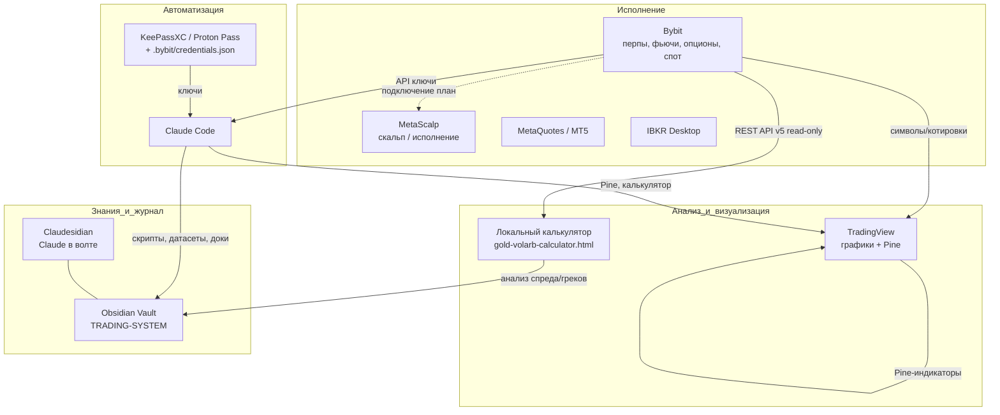

# ИНФРАСТРУКТУРА — приложения и как они связаны

> Черновик статьи. Описывает рабочий стек: какие приложения использую, какую роль каждое играет и как они соединены потоками данных. `[поправь]` — места под твои уточнения.

---

## TL;DR

Торговый контур собран из нескольких слоёв: **исполнение** (биржи), **анализ и визуализация**, **знания и журнал**, **автоматизация**. Единая точка правды по знаниям — Obsidian-волт; единый источник рыночных и аккаунт-данных — Bybit API; визуализация и идеи — TradingView; автоматизация и инструменты — Claude Code.

---

## Карта связей

*(Mermaid рендерится в Obsidian. Стрелки пунктиром — планируемые связи.)*

---

## Приложения по ролям

### Исполнение
- **Bybit** — ядро. Перпы золота (XAUUSDT, XAUTUSDT, XAUTPERP), датированные фьючи XAUTUSDT-*, спот XAUTUSDT, опционы (вкл. XAUT). Десктоп + веб. RFQ/Spread trading для блочных сделок. `[поправь: что именно гоняешь на десктопе vs веб]`
- **MetaScalp** — скальп-терминал И **локальный API-шлюз исполнения**. SDK: HTTP REST + WebSocket на `127.0.0.1:17845–17855`, держит биржевые подключения (Bybit + 16 бирж) с ключами **внутри себя** — скрипты ходят на localhost без хранения ключей. Даёт: ордера (лимит/маркет/стоп), позиции, баланс, orderbook-снапшоты, **volume profile/кластеры**, mark price, фандинг, signal-levels (алерты). Док: https://metascalp.github.io/metascalp-sdk/ . Требует включения локального API в настройках MetaScalp + запущенного приложения. `[поправь: для чего используешь сам терминал — скальп/исполнение ног?]`
- **MetaQuotes / MT5** — `[поправь: используешь ли реально, для чего]`
- **IBKR Desktop** — `[поправь: роль — другой рынок? хедж? не используется?]`

### Анализ и визуализация
- **TradingView** (платная подписка) — графики, разметка, **Pine-скрипты**. Источник данных для обучения Pine — сама подписка (API не нужен). Десктопы на TV для золота/крипты.
- **Локальный калькулятор** [[scripts/webapp/README]] — один HTML-файл: синт-спред, вол-арб, стат-арб, календари, портфель/греки на Bybit API. Запуск на `localhost:8777`.

### Знания и журнал
- **Obsidian Vault** (`R_trade_proj_sin-arb`) — единая база: концепция, стратегии, формулы, риски, инфраструктура (этот файл). См. [[00-INDEX]].
- **Claudesidian + Smart Connections** — Claude и семантический поиск прямо в волте.

### Автоматизация
- **Claude Code** — строит скрипты, собирает датасеты по API, пишет Pine и калькулятор, ведёт доки и журнал.
- **KeePassXC / Proton Pass** — хранение секретов. API-ключи Bybit для скриптов — в `C:\Users\DoOs\.bybit\credentials.json` (вне git), read-only.
- **Telegram** — `[поправь: Опционный клуб, сигналы, заметки — что отсюда идёт в работу]`

---

## Потоки данных (как это работает вместе)

1. **Рыночные данные и состояние счёта** → Bybit API (read-only ключи) → калькулятор и Claude Code → анализ, греки, спреды, датасет.
2. **Идеи и визуальный контроль** → TradingView (Pine-индикаторы синт-спреда, волы) на твоей подписке.
3. **Исполнение** → Bybit (вручную / RFQ), план — через MetaScalp по API. `[поправь: текущий способ входа в ноги]`
4. **Знания и журнал** → всё стекается в Obsidian: параметры стратегий, разбор сделок, эта инфраструктура. Claude (через Claudesidian / Claude Code) читает и пишет в волт.
5. **Секреты** → KeePassXC/Proton Pass; для автоматизации — локальный файл ключей вне git.

---

## Что ещё не связано (бэклог)
- **Исполнение через MetaScalp SDK** (`127.0.0.1:178xx`): скрипты → ордера/позиции без ключей в коде. Шаги: (1) read-only зонд ping/connections/positions; (2) умное исполнение тонкого золота через orderbook+cluster → лимиты в ликвидность; (3) signal-levels из уровней калькулятора (mean±kσ, страйки, «собрано»); (4) реал-тайм WS-поток в монитор/датасет; (5) автоввод ног спреда (осознанно, после read-only).
- **Датасет-коллектор** на Bybit API (сделки/позиции/фандинг/опционы → волт) как основа для аналитики и комментариев.
- Журнал сделок по стренглам/спредам в волте.
- `[поправь: что хочешь добавить]`

---

*Версия: 0.1 (черновик) | Обновлять при изменении стека*
